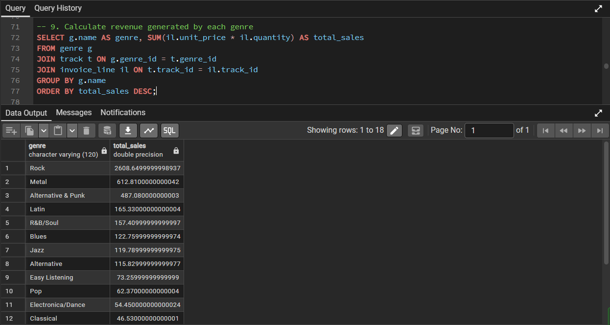
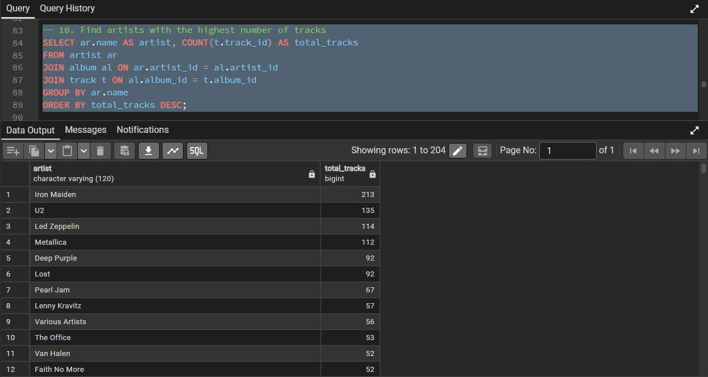
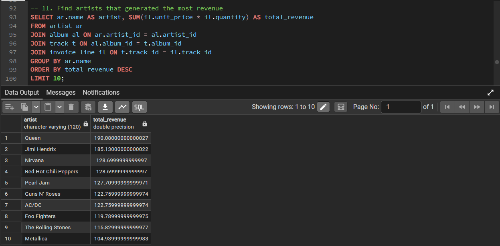

# Music Store SQL Analysis

This is a small SQL data analysis project I did to practice working with relational databases using PostgreSQL.

The dataset represents a digital music store and contains information about customers, invoices, tracks, artists and genres.  
I used SQL queries to explore the data and answer some business related questions.

## Tools used
PostgreSQL  
pgAdmin  
SQL

## Database Tables
The database includes the following tables:

customer  
invoice  
invoice_line  
track  
genre  
album  
artist  
employee  
playlist  
playlist_track  
media_type  

A schema diagram is also included in the repo to understand how the tables are connected.

## Analysis performed

Some of the questions I explored using SQL:

- identifying the top customers based on total spending  
- finding which countries generate the highest revenue  
- analyzing the most popular music genres  
- determining which artists generate the most sales  
- identifying the most purchased tracks  

The queries used for the analysis are available in `analysis_queries.sql`.

## Dataset

The database structure and data are provided in `Music_Store_database.sql`.  
This file can be used to recreate the database and run the queries.

## Purpose of this project

The goal of this project was to practice writing SQL queries involving:

- joins  
- aggregations  
- grouping  
- sorting  
- filtering data across multiple tables  

and to get more comfortable analyzing data stored in relational databases.

## Example Query Results

### Genre Revenue Analysis

### Track Purchase Count

### Revenue Insights

